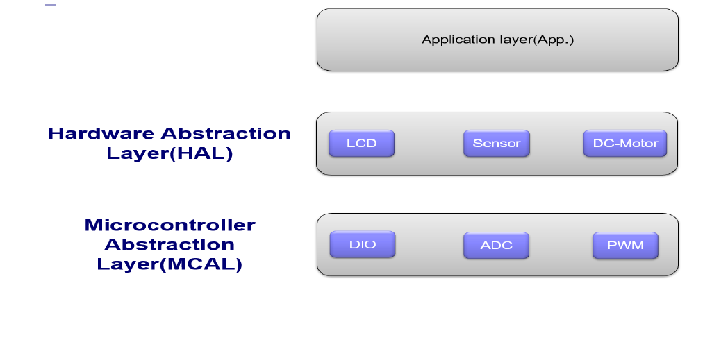

# Fan Controller System Readme

This readme file provides an overview and instructions for the Fan Controller System project, which uses an AVR ATmega32 microcontroller. The system controls a fan (represented as a motor) based on temperature readings from an LM35 temperature sensor. An LCD is used to display the motor status and current temperature. The motor speed is controlled using Fast PWM mode of Timer0, and the power applied to the motor varies according to the temperature.

## Components Used
- AVR ATmega32 microcontroller
- LM35 temperature sensor
- LCD (Liquid Crystal Display)
- Fan (motor)

## Functionality Overview
The Fan Controller System continuously monitors the temperature using the LM35 sensor and adjusts the fan speed accordingly. The system displays the motor status (on/off) and the current temperature on the LCD.

## Simualtion
- Open the simulation file and run it

## Hardware Connections
1. Connect the LM35 temperature sensor to ADC channel 2 of the ATmega32 microcontroller.
2. Connect the LCD to the appropriate pins of the microcontroller to enable communication.
3. Connect the motor to a suitable motor driver circuit or directly to the appropriate pins of the microcontroller.

## Software Implementation
The fan control system is implemented using the AVR C programming language. The following software components are included:

1. ADC Configuration: Configure the ADC in single-ended mode with a reference voltage suitable for the LM35 sensor. Use ADC channel 2 to read the temperature sensor values.

2. LCD Initialization: Initialize the LCD to establish communication with the microcontroller. Set the necessary display settings.

3. Timer0 Configuration (Fast PWM Mode): Configure Timer0 in Fast PWM mode to control the motor speed. The duty cycle of the PWM signal will be adjusted based on temperature readings.

4. Temperature Reading: Read the analog value from the LM35 temperature sensor using ADC channel 2. Convert the analog value to temperature using the appropriate formula.

5. Motor Control: Determine the appropriate power level (duty cycle) for the motor based on the temperature reading. Adjust the PWM duty cycle of Timer0 to control the motor speed.

6. Display Output: Display the motor status (on/off) and current temperature on the LCD. Update the display periodically based on the requirements of the application.

## Project Structure
- fanController.c: The main source file containing the implementation logic for the fan controller system.
- lcd.h and lcd.c: Header and source files for the LCD initialization and display functions.
- adc.h and adc.c: Header and source files for ADC configuration.
- pwm.h and pwm.c: Header and source files for Timer0 configuration.
- motor.h and motor.c : Header and source files for motor control functions.
- lm35_sensor.h and lm35_sensor.c : Header and source files for the sensor temperature reading function.
- 
## Build Instructions
1. Set up an AVR development environment (e.g., AVR-GCC and AVRDUDE) on your computer.
2. Connect the AVR ATmega32 microcontroller to the development board or programmer.
3. Clone or download the project source code to your computer.
4. Open the project in your chosen AVR development environment.
5. Build the project to generate the binary file (.hex) using the provided build or compile options.
6. Program the ATmega32 microcontroller with the generated .hex file using AVRDUDE or a suitable programmer.

## Usage
1. Power up the Fan Controller System.
2. The LCD will display the motor status (on/off) and the current temperature.
3. The motor speed will adjust automatically based on the temperature readings from the LM35 sensor.
4. Monitor the LCD for the current motor status and temperature information.

